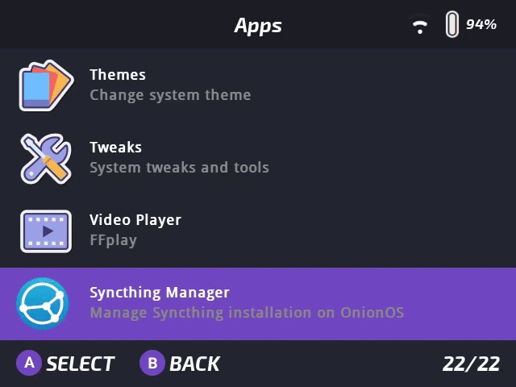

# Syncthing Manager for OnionOS

**Syncthing Manager** is a simple graphical interface for installing, configuring, and managing [Syncthing](https://syncthing.net/) on OnionOS-based devices like the Miyoo Mini Plus.



---

## ✨ Features

- ✅ Install or update the latest Syncthing release from GitHub
- ✅ Start and stop the Syncthing process
- ✅ Enable or disable Syncthing startup on boot

---

## 📦 Installation

1. **Download the latest release**:

   Go to the [Releases](https://github.com/Josh5/onion-syncthing-manager/releases) page and download the latest `SyncthingManager.zip`.

2. **Extract to your SD card**:

   Unzip the contents and copy the `SyncthingManager` folder into your SD card's `App` directory:
   `/mnt/SDCARD/App/SyncthingManager`

3. **Launch SyncthingManager** from the app list.

---

## 🧪 Controls

- **D-Pad / Arrow Keys**: Navigate
- **A / Enter**: Select menu item
- **B / Backspace**: Go back or exit
- **Menu auto-wraps** and supports scrolling descriptions

---

## 🛠️ Building It Yourself

To build the project from source:

### Steps

```bash
git clone https://github.com/Josh5/onion-syncthing-manager.git
cd onion-syncthing-manager
./build.sh
```

This will produce a zip archive in the `./dist/` folder.
